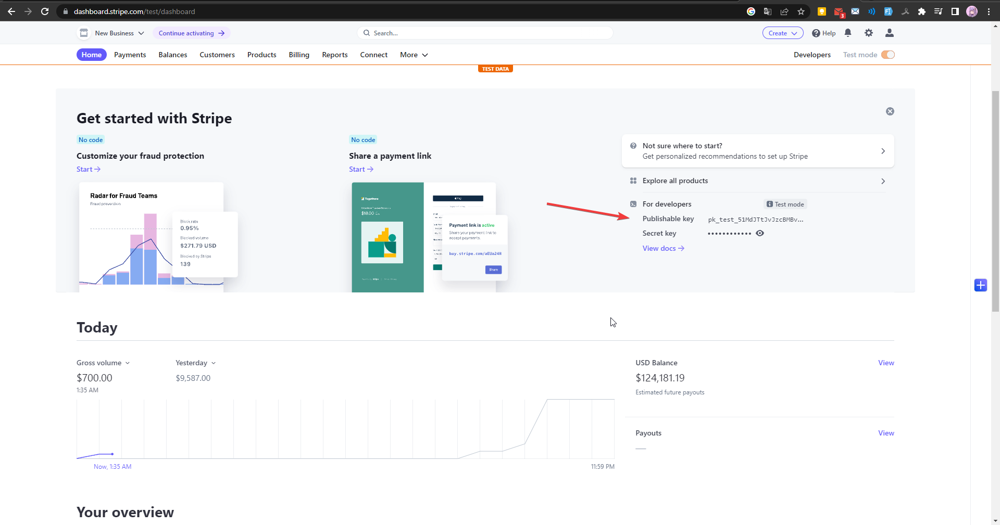
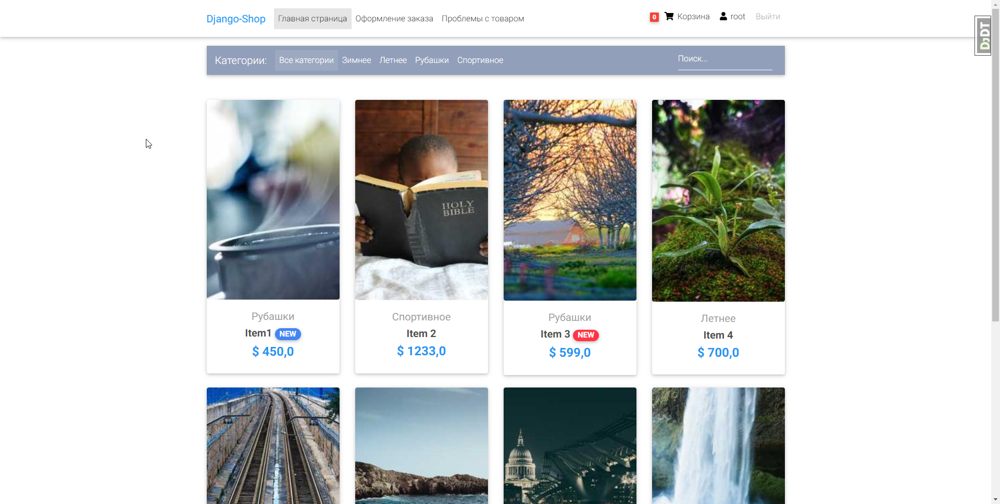
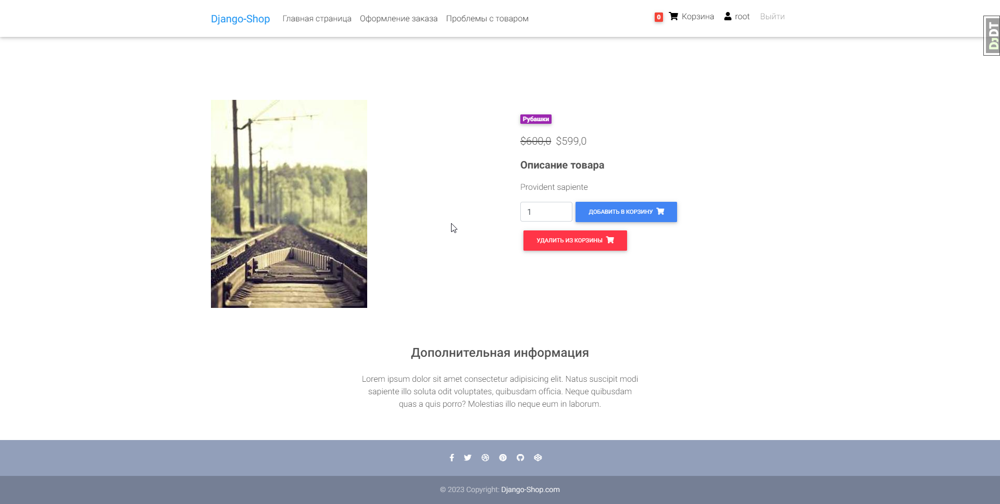
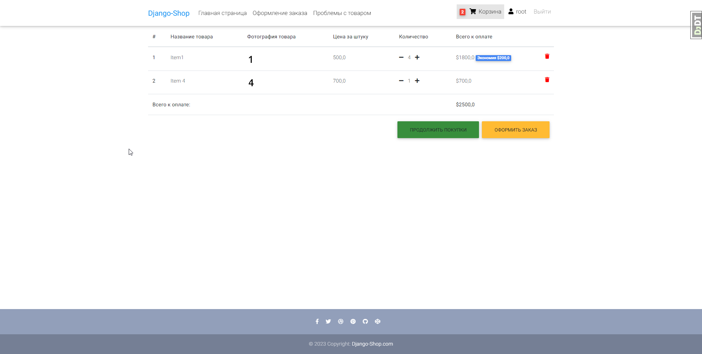
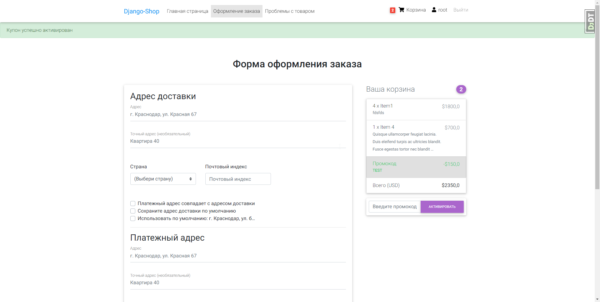
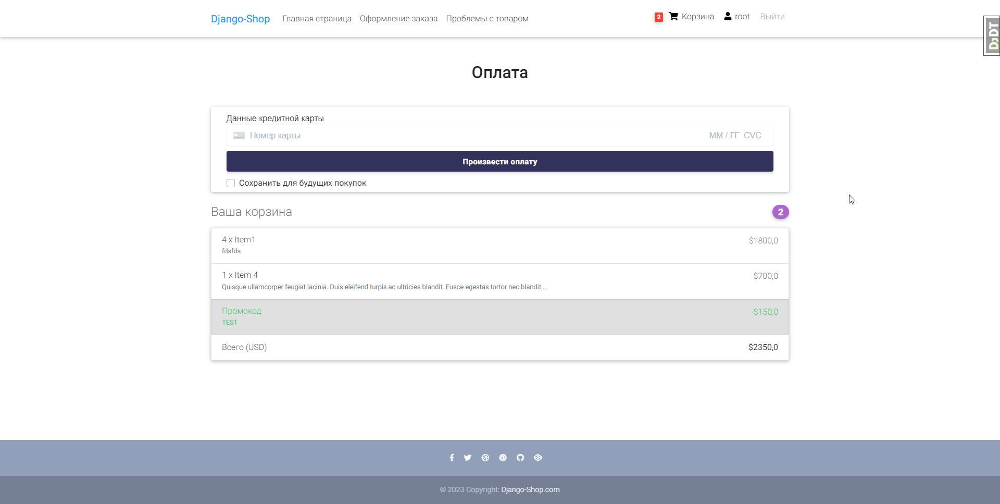
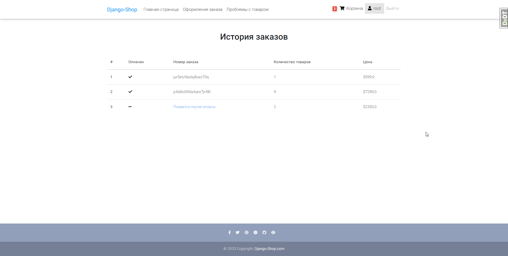
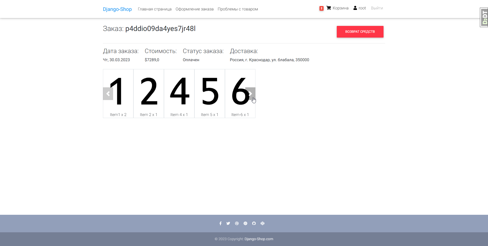

# eCommerce Project 

----

## 📄 Описание проекта
Django eCommerce - это полнофункциональный интернет-магазин, который обеспечивает легкий и удобный процесс покупок для клиентов. Регистрация на сайте реализована через библиотеку django-allauth. 

На странице оформления заказа пользователи могут указать место для доставки и выбрать оплату через сервис Stripe. Это обеспечивает безопасную и удобную оплату онлайн с помощью кредитных карт.

В случае, если клиент по ошибке совершил платеж или не удовлетворен качеством товара, он может перейти в свой профиль, выбрать нужный заказ и оформить возврат средств.

## 🔧 Стек технологий
[](https://www.python.org)
[](https://www.djangoproject.com)


- Python 3.7
- Django 2.2
- JavaScript
- PostgreSQL


## Наполнение .env файла для работы проекта локально
```dotenv
SECRET_KEY="your-secret-key"

# Необходимо получить ключи на сайте Stripe - https://stripe.com/
STRIPE_LIVE_PUBLIC_KEY=sk_test_51MdJTtJvJzcBM...
STRIPE_LIVE_SECRET_KEY=sk_test_51MdJTtJvJzcBM...
```

### Подробнее о ключах Stripe
- Необходимо зарегистрироваться на сайте
- Для получения ключей нужно пройти процесс аутентификации
- Получить тестовые ключи


-------------

# Как запустить проект

1) Клонировать репозиторий
```shell
git clone git@github.com:Dazzy132/Django-eCommerce.git
```

2) Создать и активировать виртуальное окружение
```shell
python -m venv venv

source venv/Scripts/activate (Для Windows)
source venv/bin/activate (Для Linux и MacOS)
```
3)  Установить зависимости
```shell
pip install -r requirements.txt
```
4) Выполнить миграции
```shell
python manage.py makemigrations
python manage.py migrate
```
5) Создать суперпользователя (Рекомендуется)
```shell
python manage.py createsuperuser --username=root --email=root@mail.ru
```

6) Запустить сервер
```shell
python manage.py runserver
```

-----------------

# Как выглядит сайт








